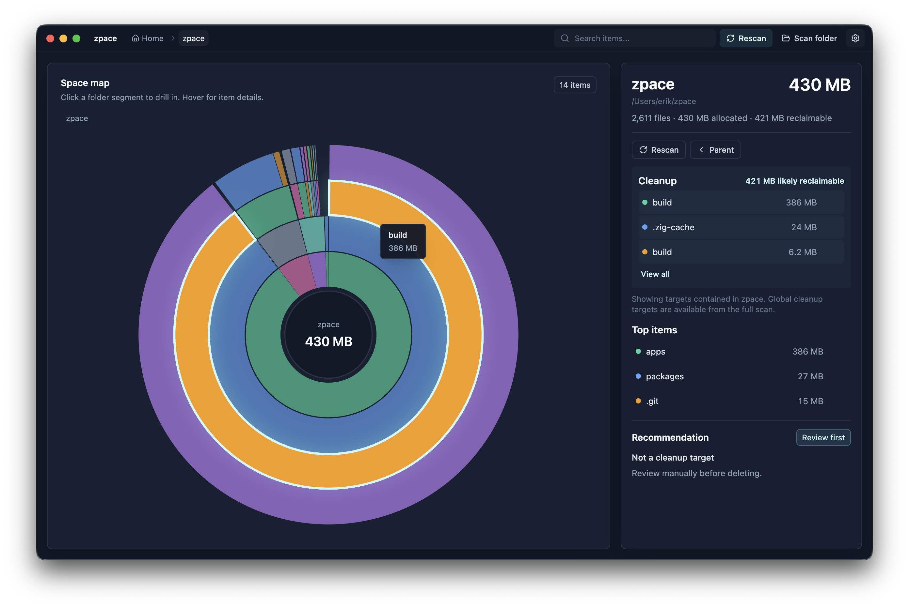

# zpace

**zpace is a macOS disk space visualizer and cleaner built around one principle: understand storage before removing it.**

It combines a fast local scanner, a visual space map, cleanup classification, and review-first cleanup flows so you can answer the questions that actually matter:

- What is taking up space?
- Why is it there?
- Is it safe to remove?



## What It Does

zpace scans a folder or volume, groups storage into explainable categories, and presents the result through an interactive radial map plus precise item lists.

It is useful for normal Mac storage problems, such as downloads, caches, archives, app data, and large media folders. It is also deliberately strong on developer storage: dependency folders, build output, package-manager caches, Xcode artifacts, simulators, Docker storage, and framework caches.

The goal is not to delete aggressively. The goal is to make storage legible enough that cleanup decisions are deliberate.

## Current Status

This repository contains an active early implementation:

- SolidJS web UI with an interactive radial usage map
- Electrobun desktop wrapper for macOS
- shared scanner package with a TypeScript orchestration layer
- Zig-owned production scan path behind the scanner package
- CLI wrapper for local scans
- scan result schema, presentation helpers, and tests
- product docs for safety, scanner contracts, cleanup detection, and roadmap

Cleanup remains review-first by design. Permanent deletion is not the default product direction.

## Product Flow

```txt
Scan -> Explore -> Understand -> Queue -> Review -> Move to Trash
```

The app should never jump directly from scan results to destructive action. zpace surfaces exact paths, sizes, categories, warnings, risk levels, and recommendations before anything is cleaned.

## Why zpace Exists

macOS storage often becomes confusing because large space consumers are scattered across unrelated locations:

- downloads, installers, archives, and disk images
- app support data and browser caches
- Trash and obvious reclaimable folders
- inaccessible or permission-restricted paths
- local snapshots and purgeable space
- generated developer folders such as `node_modules`, `.next`, `dist`, `build`, `target`, and `.zig-cache`
- package caches for npm, pnpm, Bun, Cargo, Go, Python, Homebrew, Xcode, Docker, and simulators

Generic cleanup tools often flatten these into unexplained paths. zpace treats them as meaningful storage categories and explains the tradeoff before cleanup.

## Safety Model

zpace is designed to be safe by default:

- no automatic deletion
- no permanent deletion by default
- exact paths shown before cleanup
- risky and protected locations flagged
- permission errors and skipped paths reported clearly
- cleanup actions reviewed before execution
- generated and cache-like data classified as recommendations, not commands

Read the full [Safety Model](docs/safety.md) for the intended cleanup contract.

## Getting Started

Requirements:

- macOS for the desktop app
- [Bun](https://bun.sh/) 1.3.9 or newer
- Zig for the native scanner build path

Install dependencies:

```sh
bun install
```

Run the web UI:

```sh
bun run dev:web
```

Run the desktop app with web hot reload:

```sh
bun run dev:desktop
```

Run a scan from the CLI:

```sh
bun run scan -- ~/Projects
```

Emit scan JSON:

```sh
bun run scan -- ~/Projects --json
```

## Development Commands

```sh
bun run build
bun run check-types
bun run test
bun run build:desktop
```

Package-specific commands live in:

- [apps/web/package.json](apps/web/package.json)
- [apps/desktop/package.json](apps/desktop/package.json)
- [packages/scanner/package.json](packages/scanner/package.json)

## Repository Layout

```txt
apps/
  desktop/   Electrobun macOS shell
  web/       SolidJS interface and radial map
packages/
  scanner/   scan contract, CLI wrapper, runtime, Zig scanner bridge
  config/    shared TypeScript configuration
  env/       environment helpers
docs/
  overview.md
  safety.md
  developer-cleanup.md
  scanner-contract.md
  cli.md
  roadmap.md
```

## Documentation

- [Overview](docs/overview.md)
- [Scanner JSON Contract](docs/scanner-contract.md)
- [Safety Model](docs/safety.md)
- [Developer Cleanup Detection](docs/developer-cleanup.md)
- [CLI Concepts](docs/cli.md)
- [Roadmap](docs/roadmap.md)

## Architecture

The intended architecture keeps scanning, presentation, and shell concerns separated:

- Zig owns production filesystem traversal and size aggregation.
- TypeScript validates, orchestrates, tests, and renders scan results.
- The scanner package exposes shared contracts used by the CLI and UI.
- The SolidJS UI focuses on exploration, category presentation, and cleanup review.
- The desktop shell provides the macOS app surface.

The scanner contract is documented in [docs/scanner-contract.md](docs/scanner-contract.md).

## Roadmap

Near-term work focuses on making the first usable version complete:

- home folder, selected folder, and volume scanning
- streamed scan progress
- stronger category classification
- cleanup queue and review state
- move-to-Trash cleanup path
- clearer warnings for inaccessible and skipped paths
- project-level developer storage summaries

See [docs/roadmap.md](docs/roadmap.md) for the broader product direction.
